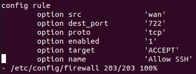
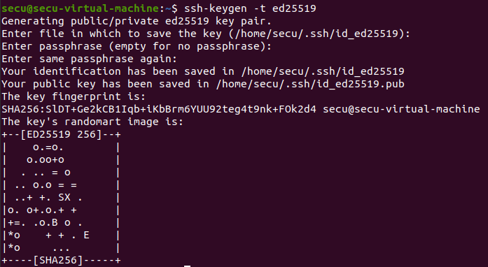
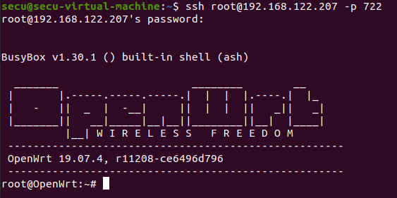
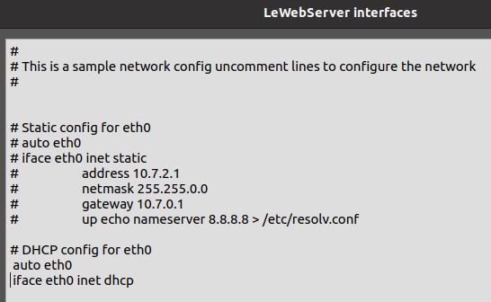
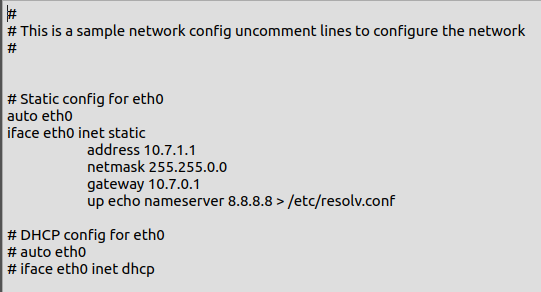

title: ”B2 - Lab 1”
author:
- Pierre DA SILVA
- Théo ARNAL<br>
output:
pdf_document: default

___
# Stage 1 :

Pour commencer, ouvrir gns3 et créer un nouveau projet nommé Lab1. Dans ce projet, il faut importer un NAT et un OpenWrt. Il faut les renommer respctivement LeNat07 et Le Routeur.
Ensuite, il faut mettre un lien entre les deux appareils, pour LeNat07, ce sera connecté en nat0 et pour Le Routeur, il faut le connecter en eth01, car il s'agit du port se connectant en WAN.

___
# Stage 2 :

Avant d'installer openssh-server, il faut éxécuter la commande : 
```
opkg update
```
afin d'obtenir la mise à jour des listes, ensuite faire :
```
opkg install openssh-server
```
Ensuite il faut editer le firewall dans *etc/config/firewall*. Il faut ajouter une règle pour pouvoir se connecter en SSH.<br><br>
<br><br>
Cela étant fait, il faut redémarrer le firewall avec la commande :
```
service firewall restart
```

Il faut changer le port dans le fichier */etc/ssh/sshd_config*, il suffit de décommenter la ligne 13 et remplacer le port **22** par **722**.

Ensuite, sur la machine hôte, il faut générer une clé :<br><br>


Il faut vérifier que la connexion fonctionne, pour cela, sur la machine hôte, il faut éxécuter la commande :
```
ssh root@192.168.122.207 -p 722
```



Les avantages de la clé ed25519 sont que la clé est plus courte et plus sécurisée. Elle prend aussi moins de ressources à chiffrer et déchiffrer.

___
# Stage 3 :

Faire la commande suivante afin d'installer luci :
```
okpg install luci
```

Ensuite il suffit d'éditer le fichier */etc/config/uhttpd* et de changer le *list listen_http* de *0.0.0.0:80* à *127.0.0.1:80*.

Dans le fichier */etc/ssh/sshd_config*, il faut décommenter *AllowTcpForwarding yes* et *GatewayPorts yes*.


Cela fait, il faut se connecter pour pouvoir tester le port forwarding avec l'hôte :
```
sudo ssh -L788:127.0.0.1:80 root@192.168.122.207 -p 722
```

Ensuite, il faut se rendre sur un navigateur et entrer l'url *127.0.0.1:788*, si tout fonctionne correctement, l'interface openwrt apparaitra.

___
# Stage 4 :

Pour la partie 4, il faut se rendre dans le fichier */etc/config/network*, dans la partie **lan**, et éditer les options *ipaddr* et *netmask* pour mettre la nouvelle adresse qui est *10.7.0.1* et le masque qui est *255.255.0.0*.


La RFC qui définit qu'elles sont les les adresses privées est la **1918**.<br>
Les préfixes des adresses ip disponibles sont **10.0.0.0/8**, **172.16.0.0/12** et **192.168.0.0/16**.<br>
Les utilitées des adresses privées sont qu'elles sont pratiques dans les réseaux locaux, ou toute personne n'ayant pas besoin d'avoir une ip publique pour ses équipements. Elles sont aussi utiles pour pallier à la pénurie d'adresse ipv4. Le but de la division des adresses IP en trois classes A,B et C est de faciliter la recherche d'un ordinateur sur le réseau. En effet avec cette notation, il est possible de rechercher dans un premier temps le réseau que l'on désire atteindre puis de chercher un ordinateur sur celui-ci. Ainsi, l'attribution des adresses IP se fait selon la taille du réseau.

Il faut ensuite ajouter un Alpine Linux et le connecter avec un cable sur le port eth0 du OpenWRT qui correcpond au lan.

___
# Stage 5 :

Il faut editer l'interface réseau de l'Alpine linux et décommenter les lignes de DHCP afin d'installer nginx.



Sur la console de Alpine Linux, faire une mise à jour dans un premier temps :
```
apk update
```
Puis installer nginx :
```
apk add nginx
```

fichier dl dans téléchargement.


___
# Stage 6 :

Il faut prendre un ethernet switch dans la gns3 , le glisser sur l'interface et le relier d'un côté à l'Alpine linux et de l'autre côté à l'openWRT sur le port eth0. Il faut ensuite editer la configuration réseau de l'Alpine linux et recommenter les lignes de DHCP et décommenter et attribuer l'IP statique *10.7.2.1*.



___
# Stage 7 :

Pour créer deux sous-réseaux, il faut se rendre sur l'interface de openwrt, dans **Network** -> **Interfaces** et créer deux nouvelles interfaces. Dans le première interface


___
## stage 8 :

ssh -> rfc 4251
http -> rfc 1945, 2068, 2616, 7230 à 7237, 7540
ip -> rfc 791
ethernet -> 894
