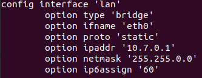
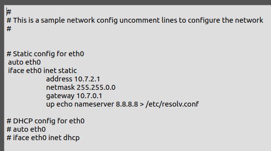

___
# Stage 1 :

Pour commencer, ouvrir gns3 et créer un nouveau projet nommé Lab1. Dans ce projet, il faut importer un NAT et un OpenWrt. Il faut les renommer respctivement LeNat07 et Le Routeur.
Ensuite, il faut mettre un lien entre les deux appareils, pour LeNat07, ce sera connecté en nat0 et pour Le Routeur, il faut le connecter en eth01, car il s'agit du port se connectant en WAN.

___
# Stage 2 :

Avant d'installer openssh-server, il faut éxécuter la commande : 
```
opkg update
```
afin d'obtenir la mise à jour des listes, ensuite faire :
```
opkg install openssh-server
```
Ensuite il faut editer le firewall dans *etc/config/firewall*. Il faut ajouter une règle pour pouvoir se connecter en SSH.<br><br>
<br><br>
Cela étant fait, il faut redémarrer le firewall avec la commande :
```
service firewall restart
```

Il faut changer le port dans le fichier */etc/ssh/sshd_config*, il suffit de décommenter la ligne 13 et remplacer le port **22** par **722**.

Ensuite, sur la machine hôte, il faut générer une clé :<br><br>


Il faut vérifier que la connexion fonctionne, pour cela, sur la machine hôte, il faut éxécuter la commande :
```
ssh root@192.168.122.207 -p 722
```


Les avantages de la clé ed25519 sont que la clé est plus courte et plus sécurisée. Elle prend aussi moins de ressources à chiffrer et déchiffrer.

___
# Stage 3 :

Faire la commande suivante afin d'installer luci :
```
okpg install luci
```

Ensuite il suffit d'éditer le fichier */etc/config/uhttpd* et de changer le *list listen_http* de *0.0.0.0:80* à *127.0.0.1:80*.

Dans le fichier */etc/ssh/sshd_config*, il faut décommenter *AllowTcpForwarding yes* et *GatewayPorts yes*.


Cela fait, il faut se connecter pour pouvoir tester le port forwarding avec l'hôte :
```
sudo ssh -L788:127.0.0.1:80 root@192.168.122.207 -p 722
```

Ensuite, il faut se rendre sur un navigateur et entrer l'url *127.0.0.1:788*, si tout fonctionne correctement, l'interface openwrt apparaitra.

___
# Stage 4 :

Pour la partie 4, il faut se rendre dans le fichier */etc/config/network*, dans la partie **lan**, et éditer les options *ipaddr* et *netmask* pour mettre la nouvelle adresse qui est *10.7.0.1* et le masque qui est *255.255.0.0*.



La RFC qui définit qu'elles sont les adresses privées est la **1918** : https://tools.ietf.org/html/rfc1918.<br>
Les préfixes des adresses ip disponibles sont **10.0.0.0/8**, **172.16.0.0/12** et **192.168.0.0/16**.<br>
Les utilitées des adresses privées sont qu'elles sont pratiques dans les réseaux locaux, ou toute personne n'ayant pas besoin d'avoir une ip publique pour ses équipements. Elles sont aussi utiles pour pallier à la pénurie d'adresse ipv4. Le but de la division des adresses IP en trois classes A,B et C est de faciliter la recherche d'un ordinateur sur le réseau. En effet avec cette notation, il est possible de rechercher dans un premier temps le réseau que l'on désire atteindre puis de chercher un ordinateur sur celui-ci. Ainsi, l'attribution des adresses IP se fait selon la taille du réseau.

Il faut ensuite ajouter un Alpine Linux et le connecter avec un cable sur le port **eth0** du OpenWRT qui correspond au lan.

___
# Stage 5 :

Il faut editer l'interface réseau de l'Alpine linux et décommenter les lignes de DHCP afin d'installer nginx.


Sur la console de Alpine Linux, faire une mise à jour dans un premier temps :
```
apk update
```
Puis installer nginx :
```
apk add nginx
```
Puis installer curl :
```
apk add curl
```

Pour pouvoir démarrer nginx, il faut créer le dossier run nginx et creer le fichier pid, puis enfin il faut lancer nginx :
```
mkdir -p /run/nginx
touch /run/nginx/nginx.pid
nginx
```

Dans le dossier */etc/nginx/*, il faut créer les dossiers pour les configurations de sites :
```
mkdir sites-available
mkdir sites-enabled
```

Ensuite, il faut créer un fichier de configuration dans le dossier */etc/nginx/sites-available* :
```
touch default.conf
```
puis l'éditer :
```
vi default.conf
```
et remplir comme ceci :
```
server {
        listen 780;
        listen [::]:780;

        root /var/www/html;
        index index.html index.htm index.nginx-debian.html;

        server_name _;

        location / {
                try_files $uri $uri/ =404;
        }
}
```

Ensuite il faut créer un lien symbolique entre les deux fichiers de configuration de *sites-enabled* et *sites-available* :
```
ln -s /etc/nginx/sites-available/default.conf /etc/nginx/sites-enabled/
```

Maintenant, il faut créer le fichier html où sera indexé le fichier pdf dans le dossier */var/www*. Il faut créer le dossier html d'abord, puis créer le fichier html, puis l'éditer :
```
mkdir html
touch html/index.html
vi html/index.html
```
Remplir comme celà :
```
<!doctype html>
	<html lang=”en”>
	<head>
		<meta charset=”utf-8”>
		<title>The HTML5 Herald</title>
		<meta name=”description” content=”The HTML5 Herald”>
		<meta name=”author” content=”SitePoint”>
	</head>
	<body>
		<a href=”./pocorgtfo01.pdf”>issue 1</a>
	</body>
	</html>
```

Il existe deux moyens de télécharger le fichier pdf : **curl** et **wget**. Les commandes sont :
```
curl -L https://openwall.info/wiki/_media/people/solar/pocorgtfo01.pdf > pocorgtfo01.pdf

wget -O pocorgtfo01.pdf https://openwall.info/wiki/_media/people/solar/pocorgtfo01.pdf
```

Afin de vérifier que la page html et que le fichier html est accessible, il faut se connecter SSH depuis l'hôte :
```
sudo ssh -L788:127.0.0.1:80 root@192.168.122.207 -p 722
```

Puis ajouter une règle de redirection de port sur l'interface openWRT à l'adresse *http://127.0.0.1:788* avec comme paramètres :<br>
*Protocol :* **TCP/UDP**, *Source zone :* **wan**, *External port :* **780**, *Destination zone :* **lan**, *Internal IP address :* **Adresse de l'Alpine**, *Internal port :* **780** :<br>


Cela fait, sur le navigateur de l'hôte, il faut se rendre sur l'adresse *192.168.122.207:780* où *192.168.122.207* est l'adresse de l'openWRT. Ici, le pdf sera accessible et téléchargeable.

___
# Stage 6 :

Il faut prendre un ethernet switch dans la gns3 , le glisser sur l'interface et le relier d'un côté à l'Alpine linux et de l'autre côté à l'openWRT sur le port eth0. Il faut ensuite editer la configuration réseau de l'Alpine linux et recommenter les lignes de DHCP et décommenter et attribuer l'IP statique *10.7.2.1*.



___
# Stage 7 :

Pour créer deux sous-réseaux, il faut se rendre sur l'interface de openwrt, dans **Network** -> **Interfaces** et créer deux nouvelles interfaces. Dans les deux interfaces, il faut mettre le protocole sur **Static address**. La première interface aura le paramètre *Interface* sur **eth2** et l'autre interface sur **eth3**. Pour la première interface, l'adresse IpV4 va être celle de la premiere Alpine linux : **10.7.2.1**. Le netmask est **255.255.0.0**, le gateway est **10.7.0.1**. La deuxième aura pour adresse IpV4 la deuxième alpine linux : **10.7.1.1**. Le netmask et le gateway sont les mêmes que précédement.

Après celà, il faut ajouter une Alpine Linux, la connecter au switch en DHCP dans un temps pour télécharger curl. Quand celà est fait, il faut lui attribuer une ip statique qui est 10.7.1.1 :<br><br>


Ensuite il faut télécharger le fichier :


___
## stage 8 :

Pour ce lab, les protocoles **SSH**, **HTTP**, **IP** et **Ethernet** ont été utilisés.<br><br>
La RFC du protocole **SSH** est la **4251** : https://tools.ietf.org/html/rfc4251.<br>
Le protocole SSH est un protocole de communication sécurisé. Il est utilisé pour l'accès à distance.<br><br>
Le protocole **HTTP** possède plusieurs RFC qui sont : RFC 1945, 2068, 2616, 7230 à 7237 et 7540.<br>
Le protocole HTTP est un protocole de communication client-serveur. Les clients HTTP les plus connus sont les navigateurs Web.<br><br>
La RFC des protocoles **IP** est la **791** : https://tools.ietf.org/html/rfc791.<br>
Le protocole IP est une famille de protocole de communication de réseaux informatiques. Lors d'une communication entre deux postes, le flux de données provenant de la couche de transport est encapsulé dans des paquets par le protocole IP.<br><br>
La RFC du protocole **Ethernet** est la **894** : https://tools.ietf.org/html/rfc894.<br>
Le protocole Ethernet est un protocole de réseau local à communications de paquets.