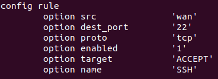

# LAB_3 Reseau

## STAGE 0

Pour commencer, ouvrir GNS3 et créer un nouveau projet nommé Lab3.GROUP_5. Dans ce projet nous allons avoir besoin de OPEN-WRT. Pour cela on va devoir clicker sur " New Template " -> "NEXT" puis choissisez la version de OPEN-WRT 19.07.4 . 
<br><br>
## STAGE 1 

Pour commencer nous allons changer l'addresse ip lan du routeur. Pour cela : 
```
vim /etc/config/network
```
et éditer cette règle : <br><br>

<br><br>

Ensuite on va devoir installer openssh-server, il faut éxécuter la commande : 
```
opkg update
```
afin d'obtenir la mise à jour des listes, ensuite faire :
```
opkg install openssh-server
```
Ensuite il faut editer le firewall dans *etc/config/firewall*. Il faut ajouter une règle pour pouvoir se connecter en SSH.<br><br>
<br><br>
Cela étant fait, il faut redémarrer le firewall avec la commande :
```
service firewall restart
```
Ensuite nous allons tester de nous connecter en ssh sur le routeur à l'aide de la commande suivante : 
```
sudo ssh -L88:127.0.0.1:80 root@192.168.122.9 -p 22
```
Maintenant que notre connexion fonctionne, nous allons ajouter une machine alpine Linux a notre routeur qui va prendre une adresse ip dynamique et qui va utiliser un serveur DNS donné par le routeur. Pour cela : Network->Interfaces->Edit Interface Lan->DHCP Server->Advanced Settings et cochez la case "Dynamic DHCP" et pour le DNS  Network->Interfaces->Edit Interface Lan->General settings-> Use custon dns "8.8.8.8" (dns de google).
<br><br>
## STAGE 2

Faire la même manipulation pour un deuxième réseau nat et changer l'adresse du sous-réseau du routeur située dans `/etc/config/network` à `192.168.6.1`.

Les deux routeurs peuvent communiquer entre eux car ils sont connectés au même nat.<br><br>
<br><br>

## STAGE 3
Pour installer wireguard, il faut se rendre sur l'interface de luci et télécharger les paquets `luci-app-wireguard` et `luci-proto-wireguard`. 

Ensuite, il suffit de se rentre dans Network > Interfaces et ajouter une nouvelle interface avec le protocole `Wireguard VPN`.<br><br>
<br><br>

Arrivé dans les paramètres, il faut rentrer une clé privée qui est générée dans le terminal grâce à la commande `wg genkey`. Ensuite, il faut mettre les adresses ip du sous réseau du VPN `172.16.5.0/24`.
<br><br>
<br><br>

Sur la machine client, il faut installer wireguard avec la commande `apk add -U wireguard-tools` et ajouter une interface wireguard.

## STAGE 4

Pour rediriger le trafic par le vpn sur l'interface web, il faut se rendre dans Network > Interfaces > Traffic Rules et créer une règle redigireant les données reçu par le wan vers le VPN, et une autre règle allant du VPN vers le routeur en spécifiant le port 22.
<br><br>
<br><br>

## STAGE 5

### Part 1
Une Fuite Vpn est une faille de sécurité qui envoit en clair vos requêtes dns en dehors du tunnel sécurisé, c'est a dire que votre navigation n'est plus 
privé (expose votre géolocalisation et emplacement de votre FAI).


### Part 2
Le DNS (Domain Name System) est un service qui traduit les noms de domaine en adresse Ip, ce qui rend la navigation sur internet beaucoups plus 
simple.

3 DNS que vous pouvez utiliser chez vous :

	- Google public DNS
	- Cloudfare
	- OpenDNS


Le Serveur racine du DNS est un serveur DNS qui fonctionne dans la zone racine. Ils concernent les nom de domaine de premier niveau(TLD).
Il Existe 13 addresses de serveur racine DNS :

A	- 192.41.0.4	:	ns.internic.net
B	- 199.9.14.201	:	ns1.isi.edu
C	- 192.33.4.12	:	c.psi.net
D	- 199.7.91.13	:	terp.umd.edu
E	- 192.203.230.10:	ns.nasa.gov
F	- 192.5.5.241	:	ns.isc.org
G	- 192.112.36.4	: 	ns.nic.ddn.mil
H	- 198.97.190.53	:	aos.arl.army.mil
I	- 192.36.148.17	:	nic.nordu.net
J	- 192.58.128.30
K	- 193.0.14.129
L	- 199.7.83.42
M	- 202.12.27.33


Comme solution DNS pour bloqué les publicités, on peut utliser 'Unbound'.