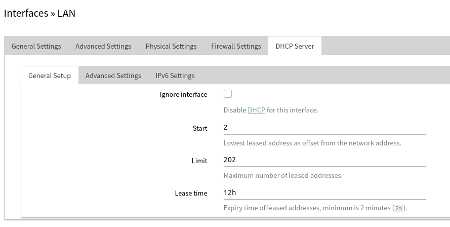
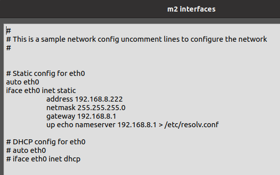
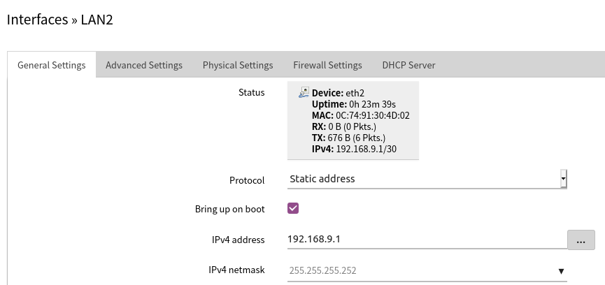
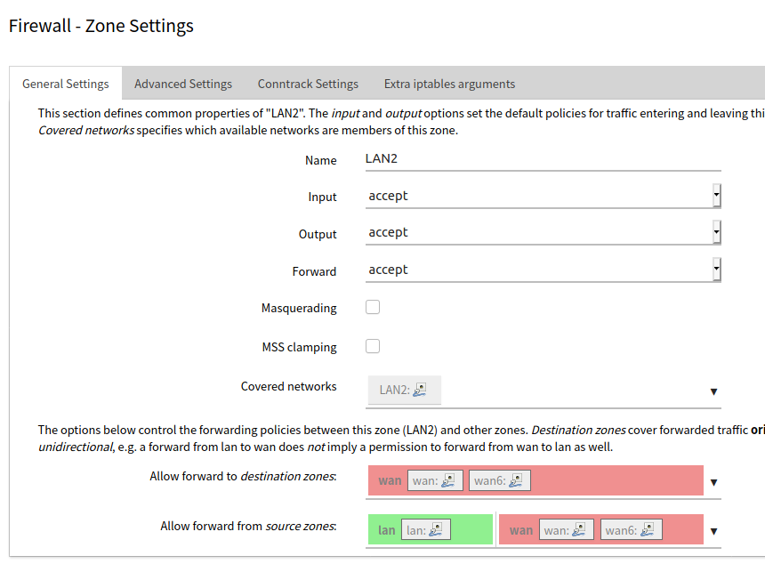
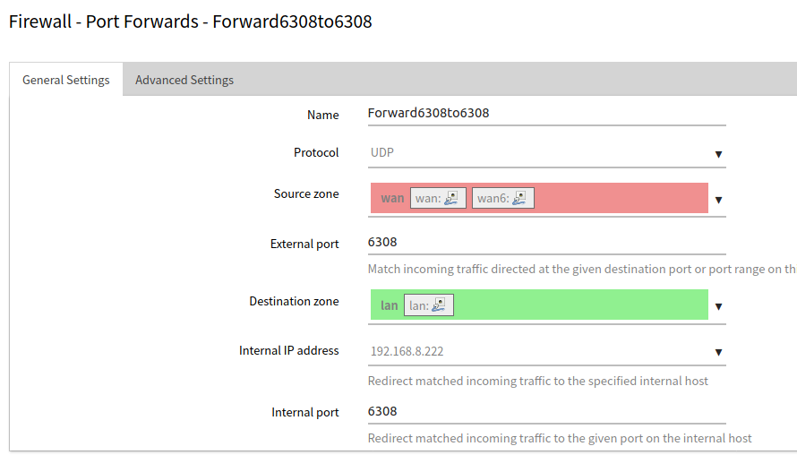
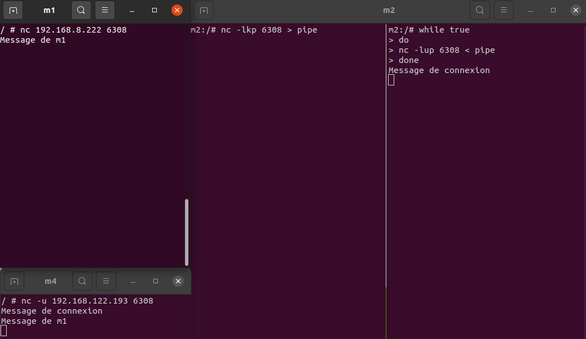
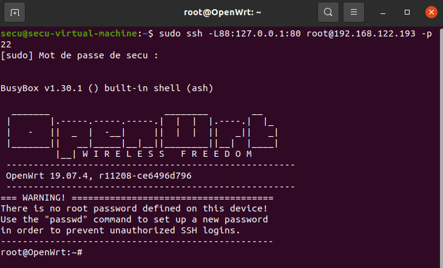

# LAB_4 Reseau

## Part 1 : Lan One

Pour commencer on va devoir installer openssh-server, il faut éxécuter la commande : 
```
opkg update
```
afin d'obtenir la mise à jour des listes, ensuite faire :
```
opkg install openssh-server
```
Ensuite il faut editer le firewall dans *etc/config/firewall*. Il faut ajouter une règle pour pouvoir se connecter en SSH.
<br><br>

<br><br>

Cela étant fait, il faut redémarrer le firewall avec la commande :
```
service firewall restart
```
Ensuite nous allons tester de nous connecter en ssh sur le routeur à l'aide de la commande suivante :
```
sudo ssh -L88:127.0.0.1:80 root@192.168.122.193 -p 22
```

Puis se rendre sur le web et aller à l'adresse `http://127.0.0.1:88` pour accéder à l'interface Lucy.

Pour la premiere machine Alpine Linux `m1` nous allons lui alloué une addresse Ip grace au DHCP : 

Pour réaliser cette étape, dans Luci : `Network -> Interfaces`, modifier `LAN Rule -> DHCP serveur` et il vous suffit maintenant de préciser la plage d'adresse que vous voulez que vos machines prennent, dans le cas présent de 2 à 202.
<br><br>

<br><br>

Ensuite, pour la deuxième machine Alpine Linux `m2`, il suffit de faire clic droit sur la machine : `edit config`, décommenter les lignes pour l'ip statique et rentrer une Ip dans le même reseau, c'est à dire `192.168.8.1` et metre une Ip qui n'est pas dans l'intervalle du DHCP configuré precédement, exemple : 192.168.8.222/24 avec comme gateway 192.168.8.1 (ce qui va utiliser le DNS par défault de OpenWRT)<br><br>

<br><br>

Redémarrer votre machine et vérifier si vous pouvez ping un nom de domaine, si c'est le cas cela a fonctionné.

Avant de créer un serveur, il faut télecharger le package (lien dans le sujet) sur les 2 machines `m1` et `m2`, ensuite on peut passer a la suite.

### Les commandes NetCat pour Tcp et UDP :

Ouvrir un serveur de communication en TCP :  `nc -l 8808`  sur la machine `m2`.<br><br>

<br><br>

Rejoindre le serveur de communication en TCP : `nc 192.168.8.222 8808`    sur la machine `m1`.<br><br>

<br><br>

Ouvrir un serveur de communication en UDP : `nc -l -u 8808`   sur la machine `m2`.
Rejoindre le serveur de communication en UDP : `nc -u 192.168.8.222 8808` sur la machine `m1`.

Pour pouvoir ouvrir un serveur de communication sans que le serveur meurt lorsqu'un utilisateur se déconnecte, il faut ajouter -k sur les machines sur lesquelles vous ouvrez la connexion.
<br><br>
<br><br><br>

<br><br>

## Part 2 : Subnet

Ici, on va devoir créer une nouvelle interface LAN qui ne peut que que contenir 2 hôtes, pour cela : `Network->Interface->Add new Interface` : Name : Lan 2, Static IP, eth 2.

Assigné l'adresse IP : `192.168.9.1/30 (255.255.255.252)`.
<br><br>
<br><br>

Ensuite, créer une nouvelle Alpine Linux `m3`, mettre `192.168.9.2/30` en adresse IP statique, et on l'a connecte directement au routeur sur l'interface que l'on a créer precedemment.

## Part 3: Firewall

Pour pouvoir faire en sorte que que les machines du LAN puissent communiquer avec les machines du LAN mais que l'inverse ne soit pas possible, il faut aller dans `Firewall -> Add name` : LAN2, changez `forward` pour accept, `Covered networks` : LAN2, `Allow forward to source zones` : WAN, `Allow forward from source zones` : LAN et WAN.
<br><br>

<br><br>

Ensuite, il faut faire la redirection des ports. Pour ce faire il faut se rendre dans `Network -> Firewall -> Port forwards`, et créer deux nouvelles redirections :
<br><br>

<br><br>

<br><br>

Création d'un nouveau NAT sur lequel on connecte une nouvelle Alpine Linux `m4` :
<br><br>

<br><br>

Connecter `m3` et `m4` avec netcat :
<br><br>

<br><br>

Connecter `m4` et `m2` avec netcat : 
<br><br>

<br><br>

## Part 4: Misc

### Fun with pipes

La solution pour faire communiquer les messages est d'utiliser les tubes unix. Sur `m2`, il faut ouvrir un terminal et ouvrir serveur de chat que l'on redirige vers le tube afin de communiquer avec `m1`. Dans un second terminal on crée une boucle while qui ouvre un chat en UDP  pour établir la connexion avec `m4`, et qui prend en entrée le tube.
<br><br>

<br><br>

### SSH access

Pour permettre la connexion sans mot de passe, il faut se rendre dans le fichier `/etc/ssh/sshd_config`, et décommenter la ligne `PermitEmptyPasswords` et mettre `yes` à la place de `no`.
<br><br>

<br><br>

Ensuite, il faut installer openssh-client sur `m4`.
<br><br>

<br><br>
<br><br>

Ceci est la commande pour se connecter en utilisant un tunnel ssh :
<br><br>

<br><br>