# LAB_4 Reseau

## Part 1 : Lan One

Pour commencer on va devoir installer openssh-server, il faut éxécuter la commande : 
```
opkg update
```
afin d'obtenir la mise à jour des listes, ensuite faire :
```
opkg install openssh-server
```
Ensuite il faut editer le firewall dans *etc/config/firewall*. Il faut ajouter une règle pour pouvoir se connecter en SSH.<br><br>
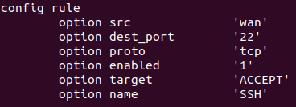<br><br>                                                                                                            prendres des screen !!!!!!!!
Cela étant fait, il faut redémarrer le firewall avec la commande :
```
service firewall restart
```
Ensuite nous allons tester de nous connecter en ssh sur le routeur à l'aide de la commande suivante :
```
sudo ssh -L88:127.0.0.1:80 root@192.168.122.193 -p 22
```

Pour la premiere machine Alpine Linux 'm1' nous allons lui alloué une addresse Ip grace au dhcp : 

pour réalisé cette étape, dans Luci : Network->Interfaces edit LAN Rule->DHCP serveur et il vous suffit maintenant de préciser la plage d'addresse que vous voulez que vos machines prennent, dans le cas present de 2 à 202.

Ensuite pour pour la deuxieme machine Alpine Linux 'm2' il suffit de fair click droit sur la machine : edit config decommenter les lignes pour l'ip Static et renter une Ip dans le meme reseau c'est a dire 192.168.8.X et metre une Ip qui n'est pas dans la range du DHCP configuré precedement ex: 192.168.8.222/24 avec comme gateway 192.168.8.1 (ce qui va utilise le DNS par default de OpenWRT)

Redemarer votre machine et verifier si vous pouvez ping un nom de domaine, si c'est le cas cela a fonctioné.

Avant de creer un serveur il faut télechargé le package (lien dans le sujet) sur les 2 machine 'm1' et 'm2' ensuite on peut passer a la suite

### Les commandes NetCat pour Tcp et UDP :
ouvrir un serveur de communication en TCP :  `nc -l 8808`     sur la machine 'm2'
rejoindre le serveur de communication en TCP : `nc 192.168.8.222 8808`    sur la machine 'm1'

ouvrir un serveur de communication en UDP : `nc -l -u 8808`   sur la machine 'm2'
rejoindre le serveur de communication en UDP : `nc -u 192.168.8.222 8808` sur la machine 'm1'

Pour pouvoir ouvrir un serveur de communication sans que lorsque un utilisateur se deconnecte ce dernier meurt ajouter -k sur les machines sur lesquelles vous ouvrez la connexion 'm2'


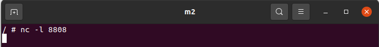<br><br>
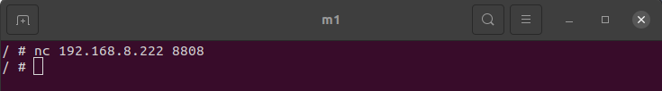<br><br>

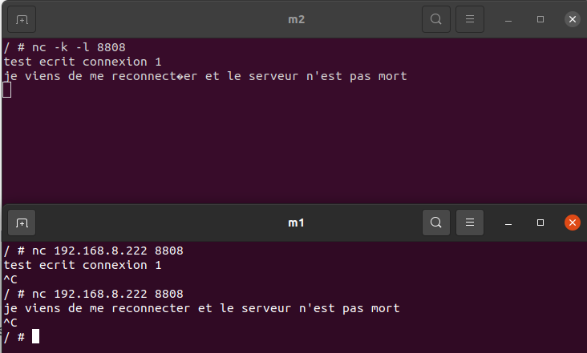<br><br>
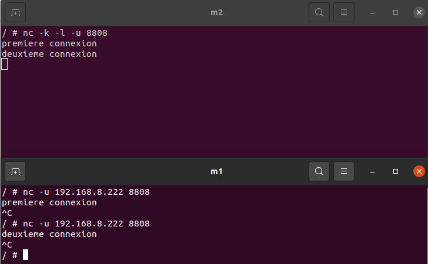<br><br>


## Part 2 : Subnet

Ici on va devoir creer une nouvelle intefance LAN qui ne peut que que contenir que seulement 2 host pour cela : Network->Interface->Add new Interface : Name:Lan 2, Static IP, eth 2.
assigné comme ip adresse : 192.168.9.1/30 (255.255.255.252).

Ensuite creer Une nouvelle Alpine Linux 'm3' mettre 192.168.9.2/30 que l'on connecte directement au routeur sur l'interface que l'on a creer precedement.


## Part 3: Firewall

Pour pouvoir faire en sorte que que les machine du LAN puissent comuniqué avec les machines du LAN mais que l'inverse ne soit pas possible, pour cela aller dans Firewall->Add name : LAN2 changez forward pour accept, Covered networks: LAN2, allowforward from source zones : LAN et WAN

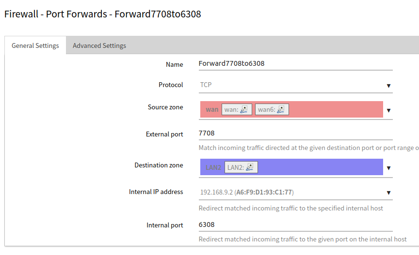<br><br>

le truc 3 que personne a compris 


Creation d'un nouveaux NAT sur lequel on connect une nouvelle Alpine Linux 'm4'.

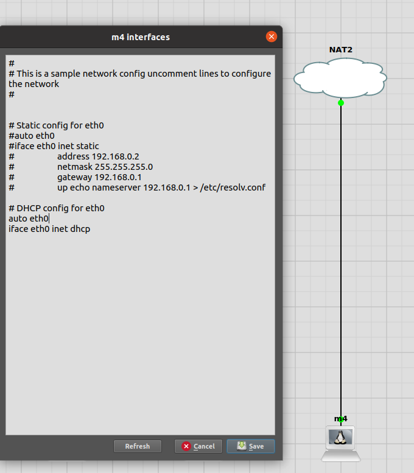<br><br>

Connecter 'm3' et 'm4' with netcat :

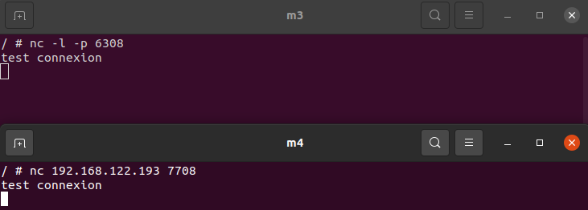<br><br>

Connecter 'm4' et 'm2' with netcat : 

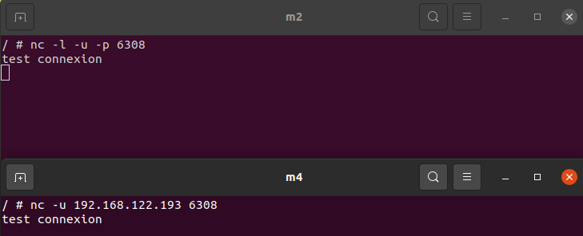<br><br>

## Pat 4: Misc

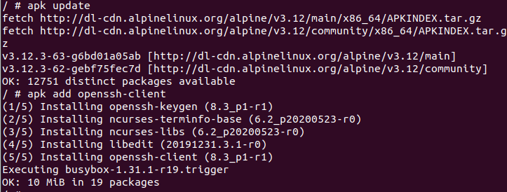<br><br>

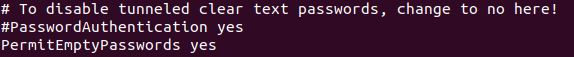<br><br>